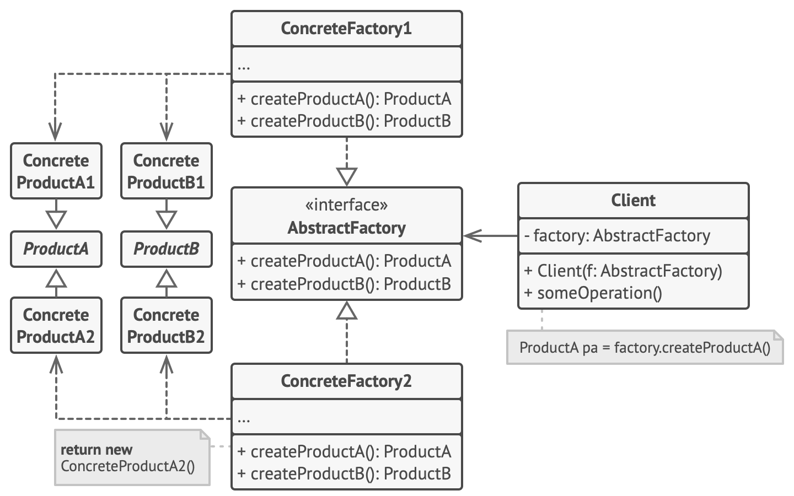

## Абстрактная фабрика

#### Назначение
Предоставляет интерфейс для создания семейств взаимосвязанных или 
взаимозависимых объектов, не специфицируя их конкретных классов.

#### Причины использования
- Система не должна зависеть от того, как создаются, компонуются и представляются 
входящие в нее объекты.
- Входящие в семейство взаимосвязанные объекты должны использоваться вместе и
вам необходимо обеспечить выполнение этого ограничения.
- Система должна конфигурироваться одним из семейств составляющих ее объектов.
- Вы хотите предоставить библиотеку объектов, раскрывая только их интерфейсы, 
но не реализацию.

#### Структура

#### Преимущества
- Изолирует конкретные классы.
- Упрощает замену семейства продуктов.
- Гарантирует сочетаемость продуктов.

#### Недостатки
- Сложно добавить поддержку нового вида продуктов.
